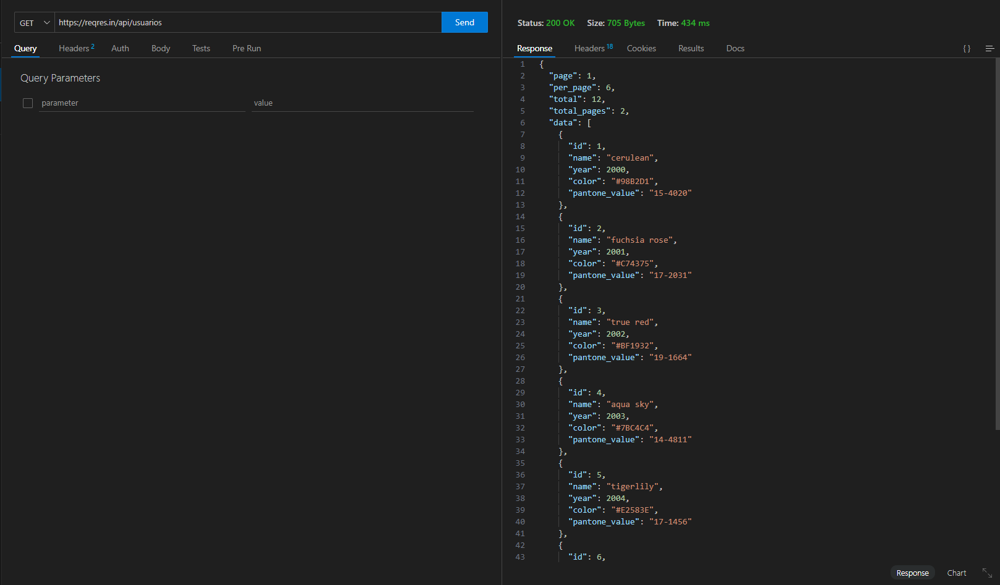

# Informe de Weather API Y REQREST
## INDICE
1. Weather api
2.
## Weather api
La Weather API es una API que proporciona datos meteorológicos en tiempo real y pronósticos del tiempo para cualquier ubicación geográfica. Permite acceder a información como temperatura, humedad, velocidad del viento, pronósticos a corto y largo plazo, entre otros datos relacionados con el clima.
### Características principales:
* Acceso a datos meteorológicos actualizados.
* Pronósticos precisos a corto y largo plazo.
* Soporte para múltiples unidades de medida.
* Integración sencilla en aplicaciones web y móviles.

### Clave de autentificacion
Key:c3645db687bd43479e3124334241005

### Consulta GET de búsqueda utilizando parámetros de URL

## ReqRes API
La ReqRes API es una API de prueba que permite simular el comportamiento de una API real para propósitos de desarrollo y pruebas. Ofrece endpoints para realizar operaciones CRUD (Crear, Leer, Actualizar, Borrar) sobre recursos ficticios como usuarios y tareas.
### Características principales:
*    Endpoints para operaciones CRUD.
*   Datos ficticios para simular respuestas de una API real.
*   Útil para pruebas de integración y desarrollo de aplicaciones.
*   No requiere autenticación para acceder a los datos.
### Consulta GET Generica

### Consulta POST Y PUT

### Consulta de búsqueda lógica

## Puntos Finales
>Get:https://reqres.in/api/usuarios.
>Get con parametros:https://www.weatherapi.com/v1/current.json?KEY=c3645db687bd43479e3124334241005&q=Cordoba.
>Post:https://reqres.in/api/usuarios.
>PUT:https://reqres.in/api/usuarios/680.
>Get Busqueda logica:https://reqres.in/api/users?page=1&per_page=5.

## Bibliografia
*   Weather api. https://www.weatherapi.com/
*   ReqRes API. https://reqres.in/